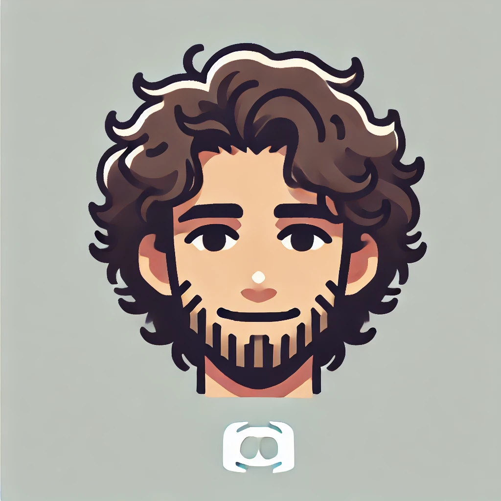

<!-- BADGES -->

  

<!-- TITLE -->
 

  

<h3 align="center">Hamdaan Bot</h3>

  

    Welcome to Hamdaan Bot, the rizz bot! This bot is designed to bring some fun and chaos to your server with brainrot phrases, rizzing up users, while offering Youtube audio streaming functionality.
     
     
    <a href="#"><strong>View Bot (TBD)»</strong></a>
  

<!-- ABOUT THE PROJECT -->
## About The Project

### Built With

* 
* 
* 
* 

(<a href="#readme-top">back to top</a>)

<!-- GETTING STARTED -->
## Getting Started & Usage

TBD after deployment

<!-- ROADMAP -->
## Roadmap

- [X] **Brainrot Phrases**: Collection of brainrot phrases to spice up the server
- [X] **Rizz Command**: `/rizz` command
- [X] **Welcome Messages**: Sends a brainrot-themed welcome message to new members when they join the server
- [X] **Youtube Music**: Connect to YouTube to play songs in the voice chat with playback controls
- [ ] **Customizable Brainrot Phrases**: Allow users to add their own brainrot phrases
- [ ] **Advanced Music Controls**: Playlist support, shuffle, etc.
- [ ] **Deployment**: Permanent solution to keep bot consistently on

(<a href="#readme-top">back to top</a>)

